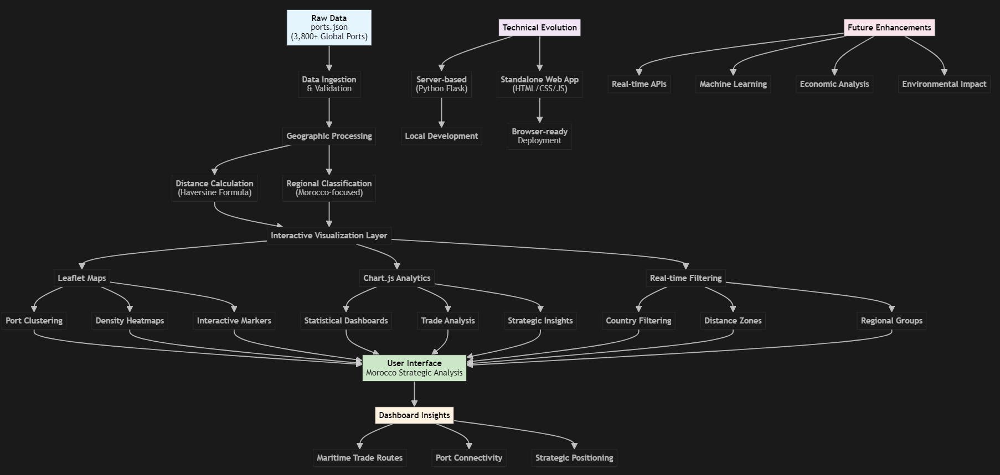

# Global Ports & Maritime Analytics Dashboard - Final Project

## Project Overview

This project represents an expansion and enhancement of web-based visualization techniques applied to maritime data analysis, with a strategic focus on Morocco's position in global trade networks. The dashboard transforms raw port data into interactive visualizations that reveal patterns in global maritime infrastructure and trade connectivity.

## Project Evolution: From Server-Based to Standalone Web Application

### Initial Development (Server-Based)
The project initially began as a Python Flask server application (`server.py`) that served port data dynamically. This approach required:
- Local Python server running on port 8000
- Separate HTML (`index.html`) and JavaScript (`dashboard.js`) files
- Server-side data processing and API endpoints

### Migration to Standalone Web Application
To improve accessibility and deployment flexibility, the project was restructured into a self-contained web application (`dashboard_standalone.html`) that:
- Eliminates server dependencies
- Runs directly in any modern web browser
- Consolidates all HTML, CSS, and JavaScript into a single file
- Fetches data directly from local JSON files using the Fetch API

This migration demonstrates the evolution from server-side to client-side data processing while maintaining full functionality.

## Dataset and Scope

**Primary Dataset**: `ports.json` - Comprehensive database of 3,800+ global ports
- **Source**: Real maritime infrastructure data
- **Fields**: Port names, countries, coordinates, geographic regions
- **Processing**: Enhanced with calculated distances from Morocco and regional classifications

**Secondary Data**: Simulated maritime analytics data for demonstration of various visualization techniques

## Technical Implementation

### Core Technologies
- **Frontend**: HTML5, CSS3, JavaScript (ES6+)
- **Mapping**: Leaflet.js with clustering and heatmap plugins
- **Visualization**: Chart.js for statistical charts
- **Data Processing**: Client-side JavaScript for real-time filtering and analysis

### Key Features
1. **Interactive Port Map**: Clustered markers with real-time filtering by country, distance, and region
2. **Port Density Heatmap**: Geographic visualization of maritime activity concentration
3. **Distance Analysis**: Strategic positioning analysis relative to Morocco
4. **Multi-dimensional Filtering**: Country, distance zones, regional groupings
5. **Trade Route Visualization**: Connectivity analysis and route optimization
6. **Statistical Dashboards**: Port capacity, efficiency metrics, and traffic analysis

## Morocco-Focused Strategic Analysis

The dashboard specifically addresses Morocco's maritime strategic position through:
- **Distance-based Analysis**: Ports categorized by proximity to Morocco (0-1000km, 1000-3000km, 3000km+)
- **Regional Connectivity**: Analysis of Mediterranean, Atlantic, and global port networks
- **Trade Partner Identification**: Visualization of key maritime trade relationships
- **Strategic Route Planning**: Cost-distance optimization for maritime logistics

## Methodology and Data Processing Techniques

### Geographic Calculations
- **Haversine Formula**: Precise distance calculations between Morocco and global ports
- **Regional Classification**: Automated grouping based on geographic and economic factors
- **Coordinate-based Clustering**: Optimized display of large datasets using marker clustering

### Data Transformation Pipeline
1. Raw port data ingestion from JSON
2. Geographic coordinate validation and processing
3. Distance calculation and regional assignment
4. Real-time filtering and aggregation
5. Dynamic visualization updates

### Visualization Techniques
- **Choropleth-style Heatmaps**: Density visualization using coordinate-based intensity
- **Interactive Filtering**: Multi-criteria selection with immediate visual feedback
- **Responsive Design**: Adaptive layouts for various screen sizes
- **Performance Optimization**: Efficient handling of large datasets through clustering

## Future Exploration Plans

This project establishes the foundation for advanced maritime analytics with real-time data integration. Future semesters will explore machine learning applications for predictive trade route optimization and Morocco's strategic maritime economic modeling.

### Planned Enhancements
1. **Real-time Data Integration**: Live shipping traffic and port capacity APIs
2. **Machine Learning Models**: Predictive analytics for trade route optimization
3. **Economic Impact Analysis**: Quantitative assessment of maritime trade effects
4. **Environmental Metrics**: Carbon footprint analysis of shipping routes
5. **Advanced Geospatial Analysis**: Multi-layered geographic information systems

## Project Diagram and Architecture

### Visual Project Flow


*Complete project flow showing data processing pipeline, technical components, and Morocco-focused strategic analysis.*

### Data Flow and Processing Pipeline
```
Raw Data (ports.json) 
    ↓
Data Ingestion & Validation
    ↓
Geographic Processing (Distance Calculation, Regional Assignment)
    ↓
Interactive Visualization Layer
    ├── Leaflet Maps (Clustering, Heatmaps)
    ├── Chart.js Analytics (Statistical Dashboards)
    └── Real-time Filtering System
    ↓
User Interface (Morocco-Focused Strategic Analysis)
```

### Technical Architecture
```
dashboard_standalone.html
├── HTML Structure
│   ├── Dashboard Sections
│   ├── Interactive Maps
│   └── Chart Containers
├── CSS Styling
│   ├── Responsive Layout
│   ├── Chart Themes
│   └── Interactive Elements
└── JavaScript Logic
    ├── Data Loading (ports.json)
    ├── Map Initialization (Leaflet)
    ├── Chart Creation (Chart.js)
    ├── Filtering System
    └── Interactive Features
```

## Running the Project

### Standalone Version (Recommended)
1. Open `dashboard_standalone.html` directly in any modern web browser
2. Ensure `ports.json` is in the same directory for data loading
3. No server setup required

### Legacy Server Version (Optional)
1. Run `python server.py` in the project directory
2. Access `http://localhost:8000` in web browser
3. Requires Python environment

## Academic Contribution

This project demonstrates the practical application of:
- **Data Visualization Theory**: Transforming complex datasets into accessible visual formats
- **Geographic Information Systems**: Spatial analysis and coordinate-based calculations
- **Web Development**: Modern JavaScript frameworks and APIs
- **User Experience Design**: Interactive filtering and responsive interfaces
- **Strategic Analysis**: Geographic positioning and trade route optimization

The focus on Morocco provides a real-world case study in maritime strategic planning and demonstrates how data visualization can inform policy and business decisions in international trade.

## Files Structure

```
ports/
├── dashboard_standalone.html    # Main application (standalone)
├── index.html                  # Legacy HTML structure
├── server.py                   # Python server (optional)
├── ports.json                  # Primary dataset (3,800+ ports)
├── diagram.png                 # Project architecture diagram
└── README.md                   # This documentation
```

## Contact and Development

This project was developed as part of a data visualization and web development course, demonstrating the evolution from basic server-side applications to sophisticated client-side analytics platforms. The focus on Morocco's maritime strategy provides a practical framework for understanding global trade networks and geographic positioning in international commerce.
